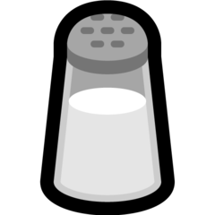

    

<h1 align="center">❯ VSCode Salt</h1>
<h3 align="center">
A VSCode extension for using <a href="https://github.com/Milo123459/salt">Salt</a> in VSCode.
<h3>
<h1></h1>
<h3 align="center">
    
    
</h3>
<h1></h1>
<h3 align="center">

    <a href="https://dev.to/milo123459/salt-task-managment-4m1m">DEV Post</a> | <a href="https://www.youtube.com/watch?v=GMMQiHexb3Y">YouTube Video</a>  | <a href="https://github.com/Milo123459/salt">Salt</a>
    

</h3>
<h1></h1>

VSCode salt is a simple way to interact with Salt via a nice UI. 